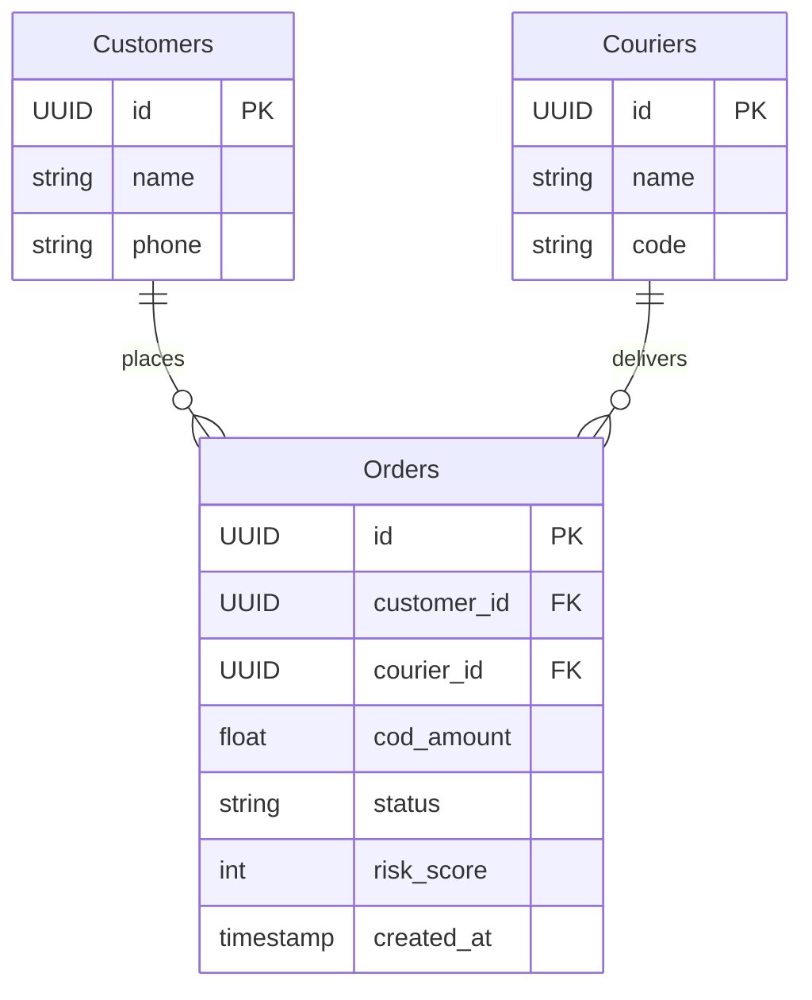

# Entity Relationship Diagram (ERD)

```mermaid
erDiagram
    Customers ||--o{ Orders : places
    Couriers ||--o{ Orders : delivers

    Customers {
        UUID id PK
        string name
        string phone
    }

    Orders {
        UUID id PK
        UUID customer_id FK
        UUID courier_id FK
        float cod_amount
        string status
        int risk_score
        timestamp created_at
    }

    Couriers {
        UUID id PK
        string name
        string code
    }
```
