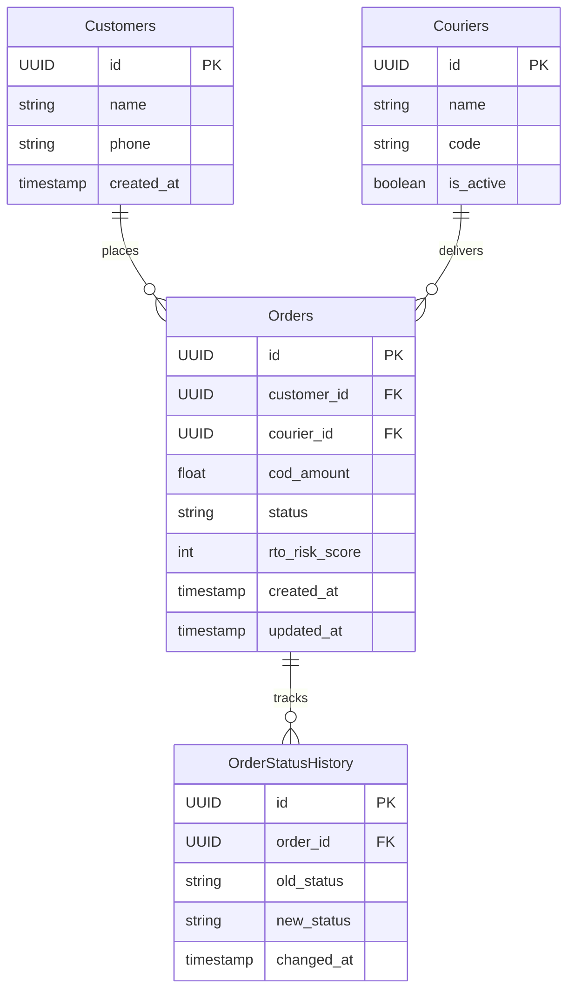

# Production ERD

Added status history to track the order lifecycle (Created, Picked Up, In Transit, Out For Delivery, Delivered, RTO).

```mermaid
erDiagram
    Customers ||--o{ Orders : places
    Couriers ||--o{ Orders : delivers
    Orders ||--o{ OrderStatusHistory : tracks

    Customers {
        UUID id PK
        string name
        string phone
        timestamp created_at
    }

    Orders {
        UUID id PK
        UUID customer_id FK
        UUID courier_id FK
        float cod_amount
        string status
        int rto_risk_score
        timestamp created_at
        timestamp updated_at
    }

    OrderStatusHistory {
        UUID id PK
        UUID order_id FK
        string old_status
        string new_status
        timestamp changed_at
    }

    Couriers {
        UUID id PK
        string name
        string code
        boolean is_active
    }
```
