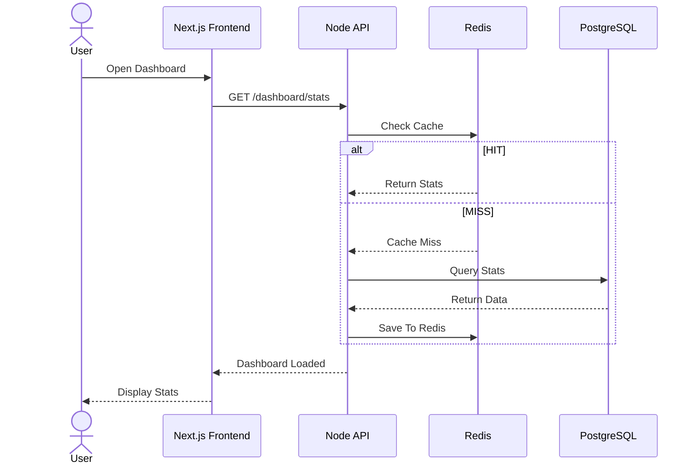

# API Sequence Diagram

```mermaid
sequenceDiagram
    actor User
    participant Frontend as Next.js Frontend
    participant API as Node API
    participant Redis as Redis
    participant DB as PostgreSQL

    User->>Frontend: Open Dashboard
    Frontend->>API: GET /dashboard/stats
    API->>Redis: Check Cache
    alt HIT
        Redis-->>API: Return Stats
    else MISS
        Redis-->>API: Cache Miss
        API->>DB: Query Stats
        DB-->>API: Return Data
        API->>Redis: Save To Redis
    end
    API-->>Frontend: Dashboard Loaded
    Frontend-->>User: Display Stats
```
