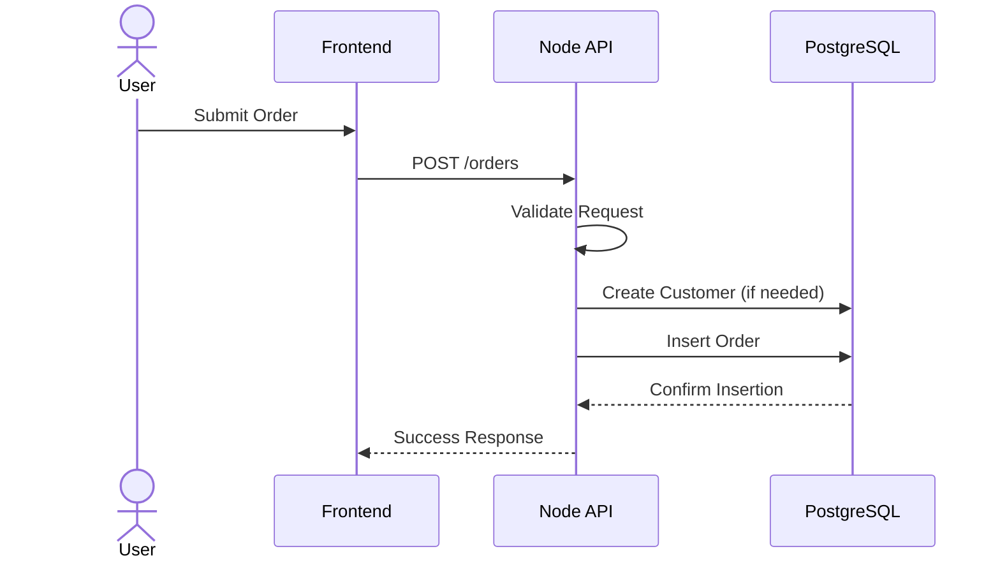

# Create Order Sequence Diagram

```mermaid
sequenceDiagram
    actor User
    participant Frontend
    participant API as Node API
    participant DB as PostgreSQL

    User->>Frontend: Submit Order
    Frontend->>API: POST /orders
    API->>API: Validate Request
    API->>DB: Create Customer (if needed)
    API->>DB: Insert Order
    DB-->>API: Confirm Insertion
    API-->>Frontend: Success Response
```
