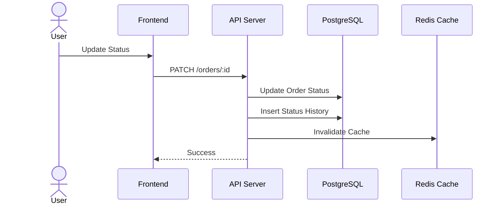

# Update Status Sequence Diagram

```mermaid
sequenceDiagram
    actor User
    participant Frontend
    participant API as API Server
    participant DB as PostgreSQL
    participant Redis as Redis Cache

    User->>Frontend: Update Status
    Frontend->>API: PATCH /orders/:id
    API->>DB: Update Order Status
    API->>DB: Insert Status History
    API->>Redis: Invalidate Cache
    API-->>Frontend: Success
```
