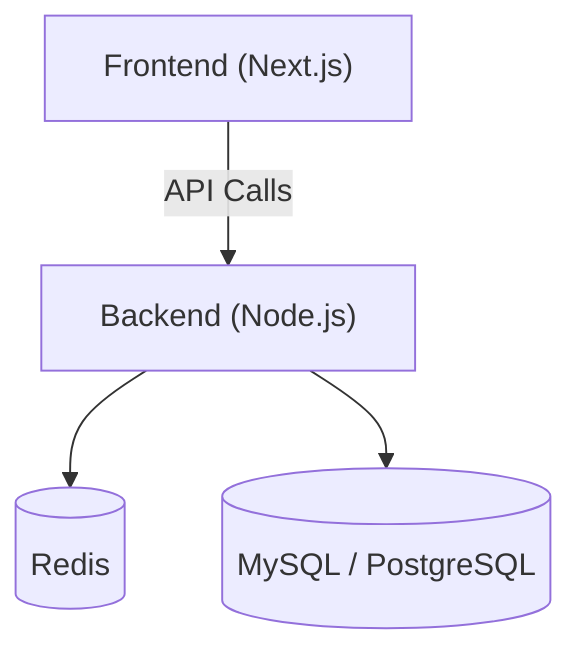

# Docker Deployment Diagram

```mermaid
graph TD
    Frontend["Frontend (Next.js)"] -->|API Calls| Backend["Backend (Node.js)"]
    Backend --> Redis[(Redis)]
    Backend --> DB[(MySQL / PostgreSQL)]
```
